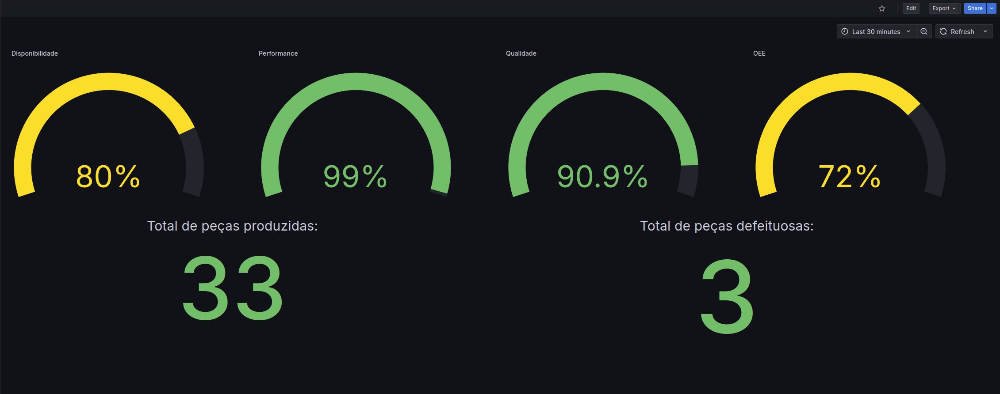

# Desafio Técnico - Pipeline de Dados EX-001

## Desenvolvido por: Vitor Rafael Marcelino

Este repositório contém minha solução para o desafio técnico da ECO Automação para a vaga de desenvolvedor backend.

---

## O que foi feito

### Dashboard de KPIs no Grafana

- Criei visualizações para os seguintes KPIs:

  - **Disponibilidade**
  - **Performance**
  - **Qualidade**
  - **OEE**
  - **Total de peças produzidas**
  - **Total de peças defeituosas**

- Todos os KPIs utilizam o filtro de tempoo (`__timeFilter`).

- JSON da dashboard disponíveis em `grafana/provisioning/dashboards/desafio-tecnico.json`.

## Dashboard final



## Consultas utilizadas em cada KPI

### Disponibilidade

```sql
SELECT
    (SUM(CASE
      WHEN ligada AND operacao AND NOT manutencao_corretiva AND NOT manutencao_preventiva THEN 1
      ELSE 0
    END)/COUNT(*)::numeric) * 100.0 AS disponibilidade
FROM dados_maquina
WHERE $__timeFilter(datahora);
```

### Performance

```sql
SELECT
  SUM(pecas_produzidas) / NULLIF(EXTRACT(EPOCH FROM MAX(datahora) - MIN(datahora)), 0) * 3600 AS performance
FROM dados_maquina
WHERE $__timeFilter(datahora)

```

### Qualidade

```sql
SELECT
  ((SUM(pecas_produzidas)-SUM(pecas_defeituosas))::numeric/NULLIF(SUM(pecas_produzidas),0))*100 AS qualidade
FROM dados_maquina 
WHERE $__timeFilter(datahora);
```

### OEE

```sql
Utilizado expressão matemática do grafana => ($qualidade/100) * ($disponibilidade/100) * ($performance/100)
```

### Total de peças produzidas

```sql
SELECT SUM(pecas_produzidas) FROM dados_maquina WHERE $__timeFilter(datahora);
```

### Total de peças defeituosas

```sql
SELECT SUM(pecas_defeituosas) FROM dados_maquina WHERE $__timeFilter(datahora);
```